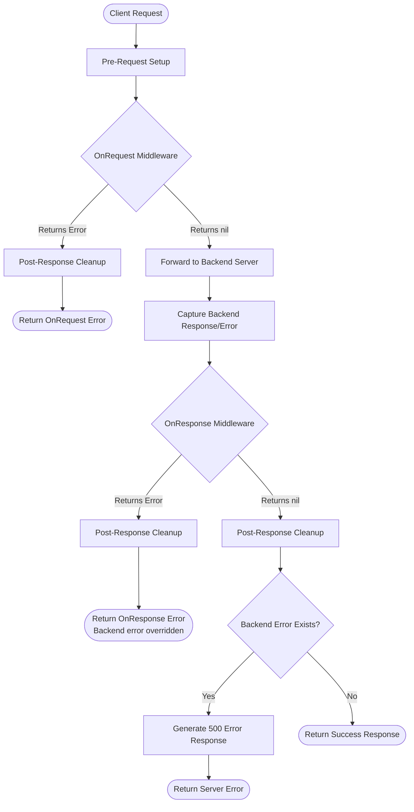

<br />
<div align="center">
  <h3 align="center">Divisor</h3>

  <p align="center">
    Un equilibrador de carga rápido y fácil de configurar
    <br />
    <br />
  </p>
</div>

<details>
  <summary>Tabla de Contenidos</summary>
  <ol>
    <li><a href="#about-the-project">Acerca del Proyecto</a></li>
    <li><a href="#features">Características</a></li>
    <li><a href="#installation">Instalación</a></li>
    <li><a href="#usage">Uso</a></li>
    <li><a href="#configuration">Configuración</a></li>
    <li><a href="#custom-middleware">Middleware Personalizado</a></li>
    <li><a href="#limitations">Limitaciones</a></li>
    <li><a href="#benchmark">Benchmark</a></li>
    <li><a href="#todo">TODO</a></li>
    <li><a href="#contributors">Contribuyentes</a></li>
    <li><a href="#license">Licencia</a></li>
  </ol>
</details>

## Acerca del Proyecto
Este proyecto está diseñado para proporcionar un equilibrador de carga rápido y fácil de configurar en el lenguaje Go. Actualmente incluye los algoritmos **round-robin**, **weighted round-robin**, **least-connection**, **least-response-time**, **ip-hash** y **random**, pero tenemos más que agregar a nuestra lista de [TODO](#todo).

El proyecto se desarrolla utilizando la biblioteca [fasthttp](https://github.com/valyala/fasthttp) para HTTP/1.1, lo que garantiza un alto rendimiento. Para admitir HTTP/2, utiliza el paquete nativo de Go `net/http` con configuración de HTTP/2. Su propósito es distribuir la carga uniformemente entre varios servidores mediante el enrutamiento de las solicitudes entrantes.

El proyecto busca simplificar el proceso de configuración para los usuarios mientras realiza las funciones esenciales de los equilibradores de carga. Por lo tanto, ofrece varias opciones de configuración que se pueden ajustar para satisfacer las necesidades de los usuarios.

Este proyecto es particularmente adecuado para aplicaciones y sitios web a gran escala. Se puede utilizar para cualquier aplicación que requiera un equilibrador de carga, gracias a su alto rendimiento, facilidad de configuración y soporte para diferentes algoritmos.


## Características
- Equilibrador de carga rápido y fácil de configurar.
- Admite los algoritmos round-robin, weighted round-robin, least-connection, least-response-time, hash de IP y random.
- Admite TLS y HTTP/2 para el servidor frontend.
- Soporte para middleware personalizado escrito en Go.
- Utiliza la biblioteca fasthttp para HTTP/1.1 y el paquete nativo de Go `net/http` para HTTP/2, asegurando alto rendimiento y escalabilidad.
- Ofrece múltiples opciones de configuración para adaptarse a las necesidades del usuario.
- Puede manejar aplicaciones y sitios web a gran escala.
- Incluye un sistema de monitoreo integrado que muestra información en tiempo real sobre el uso de CPU, uso de RAM, número de Goroutines y conexiones abiertas del sistema.
- Soporte para Prometheus para monitoreo. (`http://monitoring-host:monitoring-port/metrics` can be used to get prometheus metrics)
- Proporciona información sobre el tiempo promedio de respuesta de cada servidor, el conteo total de solicitudes y la última vez que se utilizó.
- Implementación ligera y eficiente para un uso mínimo de recursos.

## Instalación

#### Descargando la Versión Estable
La última versión de Divisor se puede descargar desde la página de [releases](https://github.com/aaydin-tr/divisor/releases). Elige el binario adecuado para tu sistema, descarga y extrae el archivo, y luego mueve el binario a un directorio en la variable $PATH de tu sistema (por ejemplo, /usr/local/bin).

#### Compilando desde el Código Fuente
Alternativamente, puedes compilar Divisor desde el código fuente clonando este repositorio en tu máquina local y ejecutando los siguientes comandos:

```bash
git clone https://github.com/aaydin-tr/divisor.git &&
cd divisor &&
go build -o divisor &&
./divisor
```

#### Usando go install
También puedes instalar Divisor utilizando el comando `go install`:

```bash
go install github.com/aaydin-tr/divisor@latest
```

Esto instalará el binario de divisor en el directorio `$GOPATH/bin` de tu sistema. Asegúrate de que este directorio esté incluido en la variable `$PATH` de tu sistema para que divisor sea accesible desde cualquier lugar.

¡Eso es todo! Ahora estás listo para usar Divisor en tu proyecto.

## Uso

Necesitas un archivo `config.yaml` para usar Divisor; puedes indicarle este archivo a Divisor usando la bandera `--config`. De manera predeterminada, intentará usar un archivo `config.yaml` en el directorio donde se encuentra. [Ejemplos de archivos de configuración](https://github.com/aaydin-tr/divisor/tree/main/examples)
> :warning: Por favor, usa una ruta absoluta para "config.yaml" al utilizar la bandera "--config"

## Configuración

### Ejemplo Mínimo
```yaml
port: 8000  # Required
backends:
  - url: localhost:8080
  - url: localhost:7070
```

### Configuración Principal

| Nombre | Descripción | Tipo | Predeterminado | Obligatorio |
| --- | --- | --- | --- | --- |
| port | Puerto del servidor | string | - | ⚠️ **Sí** |
| host | Host del servidor | string | `localhost` | No |
| type | Algoritmo de balanceo de carga | string | `round-robin` | No |
| health_checker_time | Intervalo de verificación de estado para backends | duration | `30s` | No |

**Tipos de algoritmos válidos**: `round-robin`, `w-round-robin`, `ip-hash`, `random`, `least-connection`, `least-response-time`

### Configuración de Backends

| Nombre | Descripción | Tipo | Predeterminado | Obligatorio |
| --- | --- | --- | --- | --- |
| backends | Lista de servidores backend | array | - | ⚠️ **Sí** (mín: 1) |
| backends.url | URL del backend (sin protocolo) | string | - | ⚠️ **Sí** |
| backends.health_check_path | Endpoint de verificación de estado | string | `/` | No |
| backends.weight | Peso del backend (solo w-round-robin) | int | - | ⚠️ **w-round-robin** |
| backends.max_conn | Conexiones máximas por backend | int | `512` | No |
| backends.max_conn_timeout | Tiempo máximo de espera para conexión libre | duration | `30s` | No |
| backends.max_conn_duration | Duración de keep-alive de la conexión | duration | `10s` | No |
| backends.max_idle_conn_duration | Timeout de conexión inactiva | duration | `10s` | No |
| backends.max_idemponent_call_attempts | Intentos de reintentos para llamadas idempotentes | int | `5` | No |

### Configuración de Monitoreo

| Nombre | Descripción | Tipo | Predeterminado |
| --- | --- | --- | --- |
| monitoring.host | Host del servidor de métricas | string | `localhost` |
| monitoring.port | Puerto del servidor de métricas | string | `8001` |

### Configuración del Servidor

| Nombre | Descripción | Tipo | Predeterminado |
| --- | --- | --- | --- |
| server.http_version | Versión del protocolo HTTP (`http1` o `http2`) | string | `http1` |
| server.cert_file | Ruta del archivo de certificado TLS | string | - |
| server.key_file | Ruta del archivo de clave privada TLS | string | - |
| server.max_idle_worker_duration | Timeout de inactividad del pool de workers | duration | `10s` |
| server.tcp_keepalive_period | Intervalo de keep-alive TCP (predeterminado del SO si no se establece) | duration | - |
| server.concurrency | Conexiones concurrentes máximas | int | `262144` |
| server.read_timeout | Timeout de lectura de solicitud | duration | ilimitado |
| server.write_timeout | Timeout de escritura de respuesta | duration | ilimitado |
| server.idle_timeout | Timeout de inactividad de keep-alive | duration | ilimitado |
| server.disable_keepalive | Forzar cierre de conexión después de la respuesta | bool | `false` |
| server.disable_header_names_normalizing | Preservar mayúsculas/minúsculas originales de los nombres de encabezados | bool | `false` |

### Encabezados Personalizados

| Nombre | Descripción | Tipo |
| --- | --- | --- |
| custom_headers | Encabezados inyectados en las solicitudes al backend | map |
| custom_headers.`<name>` | Valor del encabezado (se admiten variables especiales) | string |

**Variables especiales**: `$remote_addr` (IP del cliente), `$time` (marca de tiempo de la solicitud), `$uuid` (UUID de la solicitud), `$incremental` (contador por backend)

**Ejemplo**:
```yaml
custom_headers:
  x-client-ip: $remote_addr
  x-request-id: $uuid
```

### Middlewares

| Nombre | Descripción | Tipo | Predeterminado | Obligatorio |
| --- | --- | --- | --- | --- |
| middlewares | Lista de middlewares personalizados | array | - | No |
| middlewares.name | Identificador del middleware | string | - | ⚠️ **Sí** |
| middlewares.disabled | Omitir ejecución del middleware | bool | `false` | No |
| middlewares.code | Código Go en línea | string | - | ⚠️ **Sí** (o file) |
| middlewares.file | Ruta al archivo de código Go | string | - | ⚠️ **Sí** (o code) |
| middlewares.config | Configuración pasada al constructor del middleware | map | - | No |

### Notas Importantes

- **Eliminación de protocolo**: Las URLs de los backends tienen automáticamente eliminado `http://` o `https://`
- **Requisito de HTTP/2**: `server.http_version: http2` requiere tanto `cert_file` como `key_file`
- **Weighted round-robin**: Un solo backend se convierte automáticamente en round-robin regular
- **Validación de middleware**: Debe especificarse `code` O `file` (no ambos), a menos que `disabled: true`
- **Validación de encabezados personalizados**: Solo acepta las 4 variables especiales listadas arriba
- **Algoritmo predeterminado**: Si se omite `type` o es inválido, predetermina `round-robin`


Por favor, consulta los [ejemplos de archivos de configuración](https://github.com/aaydin-tr/divisor/tree/main/examples)

## Middleware Personalizado

Divisor admite middleware personalizado escrito en Go. Puedes definir middleware para interceptar solicitudes y respuestas, lo que te permite implementar lógica personalizada como autenticación, registro de actividad, manipulación de encabezados, etc.

El middleware se ejecuta utilizando el intérprete [Yaegi](https://github.com/traefik/yaegi).

### Uso

Tu middleware debe implementar la interfaz `Middleware` y proporcionar un constructor de función `New`.

> :warning: Asegúrate de ejecutar `go get github.com/aaydin-tr/divisor/middleware` para importar el paquete de middleware. 

```go
package middleware

import (
    "github.com/aaydin-tr/divisor/middleware"
    "fmt"
)

type MyMiddleware struct {
    config map[string]any
}

func New(config map[string]any) middleware.Middleware {
    return &MyMiddleware{config: config}
}

func (m *MyMiddleware) OnRequest(ctx *middleware.Context) error {
    // Logic to execute before request reached to backend server
    // e.g. ctx.Request.Header.Set("X-Custom-Header", "Value")
    fmt.Println("OnRequest")
    return nil
}

func (m *MyMiddleware) OnResponse(ctx *middleware.Context, err error) error {
    // Logic to execute after response is received from backend server
    fmt.Println("OnResponse")
    return nil
}
```

### Configuración

Puedes configurar los middlewares en `config.yaml` utilizando código en línea o una ruta de archivo.

**Usando un archivo:**

```yaml
middlewares:
  - name: "my-logger"
    file: "./middleware/logger.go"
    config:
      prefix: "[LOG]"
```

**Usando código en línea:**

```yaml
middlewares:
  - name: "simple-header"
    code: |
      package middleware
      
      import "github.com/aaydin-tr/divisor/middleware"

      type HeaderMiddleware struct {}

      func New(config map[string]any) middleware.Middleware {
          return &HeaderMiddleware{}
      }

      func (h *HeaderMiddleware) OnRequest(ctx *middleware.Context) error {
          ctx.Request.Header.Set("X-Divisor", "True")
          return nil
      }

      func (h *HeaderMiddleware) OnResponse(ctx *middleware.Context, err error) error {
          return nil
      }
```

### Ciclo de Vida de Solicitud/Respuesta

El flujo de ejecución del middleware te permite interceptar y controlar el ciclo de vida completo de solicitud/respuesta. Esto es exactamente lo que sucede cuando se procesa una solicitud:

#### Flujo Completo de Solicitud

1.  **Configuración Pre-Solicitud**
    -   Se produce el preprocesamiento interno de la solicitud
    -   Se preparan los encabezados y el contexto de la solicitud

2.  **Ejecución del Middleware OnRequest**
    -   Se ejecuta **antes** de que la solicitud se envíe al backend
    -   Recibe el contexto del middleware con acceso completo a la solicitud/respuesta
    -   **Si `OnRequest` devuelve un error:**
        -   ⛔ La cadena de ejecución se detiene **inmediatamente**
        -   ⛔ La solicitud **NO** se envía al backend
        -   ⛔ `OnResponse` **NO** se llama
        -   ⛔ Se produce la limpieza post-respuesta
        -   ⛔ El error se devuelve al cliente
    -   **Si `OnRequest` tiene éxito (devuelve `nil`):**
        -   ✅ La ejecución continúa hacia el proxy del backend

3.  **Proxy del Backend**
    -   La solicitud se reenvía al servidor backend seleccionado
    -   La respuesta (o error) se captura y almacena
    -   **Importante:** Incluso si el backend falla, la ejecución continúa a `OnResponse`

4.  **Ejecución del Middleware OnResponse**
    -   **Siempre** se ejecuta después del intento de proxy (éxito o fallo)
    -   Recibe **dos argumentos:**
        1. El contexto del middleware
        2. El error del backend (si lo hay) - será `nil` en caso de éxito
    -   Puedes inspeccionar el error del backend y decidir cómo manejarlo
    -   **Si `OnResponse` devuelve un error:**
        -   ⚠️ **Anula** cualquier error del backend
        -   ⚠️ Se produce la limpieza post-respuesta
        -   ⚠️ Este error se devuelve al cliente
        -   ⚠️ La respuesta de error estándar es reemplazada
    -   **Si `OnResponse` devuelve `nil`:**
        -   La ejecución continúa normalmente
        -   Si existe un error del backend, se genera una respuesta de error 500 estándar
        -   Si no hay error, la respuesta del backend se envía al cliente

5.  **Limpieza Post-Respuesta**
    -   Se produce el postprocesamiento interno de la respuesta
    -   Siempre se ejecuta independientemente del éxito o fallo

6.  **Respuesta Enviada**
    -   La respuesta final se envía al cliente

#### Puntos Clave

-   🎯 **OnRequest** actúa como un portero: puede bloquear solicitudes antes de que lleguen al backend
-   🔄 **OnResponse** siempre se ejecuta después del intento de proxy, dándote la oportunidad de manejar errores del backend
-   🛡️ **OnResponse** puede anular errores del backend, permitiendo manejo y respuestas de error personalizadas
-   ⏱️ Ambos middlewares tienen acceso al contexto completo de solicitud/respuesta para inspección y modificación

### Diagrama de Solicitud/Respuesta



## Limitaciones
Aunque Divisor tiene varias características y beneficios, también tiene algunas limitaciones de las que debes ser consciente:

- Divisor actualmente opera en la capa 7, lo que significa que está diseñado específicamente para balanceo de carga HTTP(S). No admite otros protocolos, como TCP o UDP.
- Divisor no admite HTTP/3, lo cual puede ser importante para algunas aplicaciones.
- Divisor no admite HTTPS para servidores backend. HTTPS solo está disponible para el servidor frontend.

Ten en cuenta estas limitaciones al considerar si este equilibrador de carga es la elección correcta para tu proyecto.

## Benchmark
Por favor, consulta la [carpeta de benchmark](https://github.com/aaydin-tr/divisor/tree/main/benchmark) para una explicación detallada 

## TODO
Aunque Divisor tiene varias características, también hay algunas áreas de mejora planificadas para futuras versiones:

- [ ] Agregar soporte para otros protocolos, como TCP o UDP.
- [x] Agregar soporte TLS para frontend.
- [x] Soporte HTTP/2 en servidor frontend.
- [ ] Agregar más algoritmos de balanceo de carga, como:
  - [x] least connection
  - [x] least-response-time
  - [ ] sticky round-robin
- [ ] Mejorar el rendimiento y la escalabilidad para aplicaciones de alto tráfico.
- [x] Expandir las capacidades de monitoreo para proporcionar métricas y análisis más detallados.

Al abordar estos temas y agregar nuevas características, nuestro objetivo es hacer de Divisor una herramienta aún más versátil y potente para gestionar el tráfico en aplicaciones web modernas.

## Contribuyentes
<a href = "https://github.com/aaydin-tr/divisor/graphs/contributors">
  
</a>

## Licencia
Este proyecto está licenciado bajo la Licencia MIT. Consulta el archivo LICENSE para más información.

La Licencia MIT es una licencia de software de código abierto permisiva que permite a los usuarios modificar y redistribuir el código, siempre que se incluya la licencia original y el aviso de derechos de autor. Esto significa que eres libre de usar Divisor para cualquier propósito, incluidos proyectos comerciales, sin tener que pagar tarifas de licencia o regalías. Sin embargo, se proporciona "tal cual" y sin garantía de ningún tipo, por lo que úsalo bajo tu propio riesgo.
