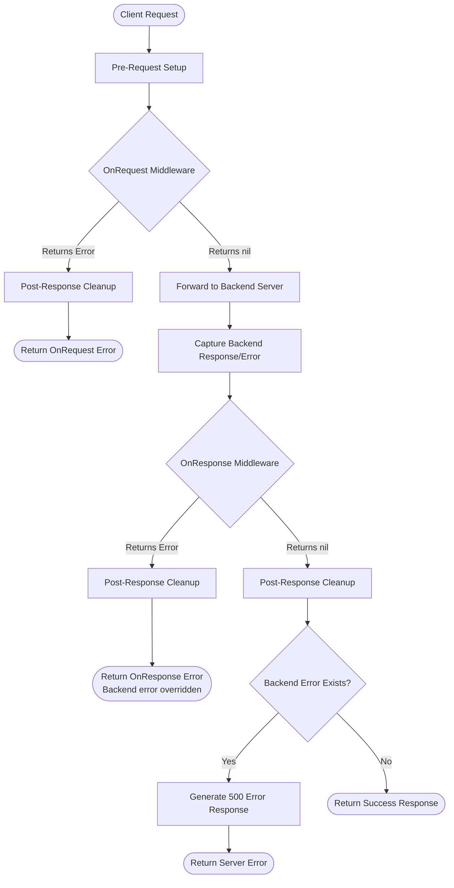

<br />
<div align="center">
  <h3 align="center">Divisor</h3>

  <p align="center">
    A fast and easy-to-configure load balancer
    <br />
    <br />
  </p>
</div>

<details>
  <summary>Table of Contents</summary>
  <ol>
    <li><a href="#about-the-project">About The Project</a></li>
    <li><a href="#features">Features</a></li>
    <li><a href="#installation">Installation</a></li>
    <li><a href="#usage">Usage</a></li>
    <li><a href="#configuration">Configuration</a></li>
    <li><a href="#custom-middleware">Custom Middleware</a></li>
    <li><a href="#limitations">Limitations</a></li>
    <li><a href="#benchmark">Benchmark</a></li>
    <li><a href="#todo">TODO</a></li>
    <li><a href="#contributors">Contributors</a></li>
    <li><a href="#license">License</a></li>
  </ol>
</details>

## About The Project
This project is designed to provide a fast and easy-to-configure load balancer in Go language. It currently includes **round-robin**, **weighted round-robin**, **least-connection**, **least-response-time**, **ip-hash** and **random** algorithms, but we have more to add to our [TODO](#todo) list.

The project is developed using the [fasthttp](https://github.com/valyala/fasthttp) library for HTTP/1.1, which ensures high performance. For HTTP/2 support, it uses the native Go `net/http` package with HTTP/2 configuration. Its purpose is to distribute the load evenly among multiple servers by routing incoming requests.

The project aims to simplify the configuration process for users while performing the essential functions of load balancers. Therefore, it offers several configuration options that can be adjusted to meet the users needs.

This project is particularly suitable for large-scale applications and websites. It can be used for any application that requires a load balancer, thanks to its high performance, ease of configuration, and support for different algorithms.


## Features
- Fast and easy-to-configure load balancer.
- Supports round-robin, weighted round-robin, least-connection, least-response-time, IP hash, and random algorithms.
- Supports TLS and HTTP/2 for the frontend server.
- Support for custom middleware written in Go.
- Uses the fasthttp library for HTTP/1.1 and native Go `net/http` package for HTTP/2, ensuring high performance and scalability.
- Offers multiple configuration options to suit user needs.
- Can handle large-scale applications and websites.
- Includes a built-in monitoring system that displays real-time information on the system's CPU usage, RAM usage, number of Goroutines, and open connections.
- Prometheus support for monitoring. (`http://monitoring-host:monitoring-port/metrics` can be used to get prometheus metrics)
- Provides information on each server's average response time, total request count, and last time used.
- Lightweight and efficient implementation for minimal resource usage.

## Installation

#### Downloading the Release
The latest release of Divisor can be downloaded from the [releases](https://github.com/aaydin-tr/divisor/releases) page. Choose the suitable binary for your system, download and extract the archive, and then move the binary to a directory in your system's $PATH variable (e.g. /usr/local/bin).

#### Building from Source
Alternatively, you can build Divisor from source by cloning this repository to your local machine and running the following commands:

```bash
git clone https://github.com/aaydin-tr/divisor.git &&
cd divisor &&
go build -o divisor &&
./divisor
```

#### Using go install
You can also install Divisor using the `go install` command:

```bash
go install github.com/aaydin-tr/divisor@latest
```

This will install the divisor binary to your system's `$GOPATH/bin` directory. Make sure this directory is included in your system's `$PATH` variable to make the divisor accessible from anywhere.

That's it! You're now ready to use Divisor in your project.

## Usage

You need a `config.yaml` file to use Divisor, you can give this file to Divisor to use with the `--config` flag, by default it will try to use a `config.yaml` file in the directory it is in. [Example config files](https://github.com/aaydin-tr/divisor/tree/main/examples)
> :warning: Please use absolute path for "config.yaml" while using "--config" flag

## Configuration

| Name | Description | Type | Default Value |
| --- | --- | --- | --- |
| type | Load balancing algorithm | string | round-robin |
| port | Server port | int | 8000 |
| host | Server host | string | localhost |
| health_checker_time | Time interval to perform health check for backends | time.Duration | 30s |
| backends | List of backends with their configurations | array |  |
| backends.url | Backend URL | string |  |
| backends.health_check_path | Health check path for backends | string | / |
| backends.weight | Only mandatory for w-round-robin algorithm | int |  |
| backends.max_conn | Maximum number of connections which may be established to host listed in Addr | int | 512 |
| backends.max_conn_timeout | Maximum duration for waiting for a free connection | time.Duration | 30s |
| backends.max_conn_duration | Keep-alive connections are closed after this duration | time.Duration | 10s |
| backends.max_idle_conn_duration | Idle keep-alive connections are closed after this duration | time.Duration | 10s |
| backends.max_idemponent_call_attempts | Maximum number of attempts for idempotent calls | int | 5 |
| monitoring | Monitoring server configurations | object |  |
| monitoring.port | Monitoring server port | int | 8001 |
| monitoring.host | Monitoring server host | string | localhost |
| custom_headers | Custom headers will be set on request sent to backend | object |  |
| custom_headers.header-name | Valid values are `$remote_addr`, `$time`, `$incremental`, `$uuid`, The Header name can be whatever you want as long as it's a string | string |  |
| server | Server configurations | object | |
| server.http_version | Http version for frontend server, http1 and http2 is supported (http1 mean HTTP/1.1) | string | http1 |
| server.cert_file | TLS cert file | string |  |
| server.key_file | TLS key file | string |  |
| server.max_idle_worker_duration | MaxIdleWorkerDuration is the maximum idle time of a single worker in the underlying worker pool of the Server | time.Duration | 10s |
| server.tcp_keepalive_period | Period between tcp keep-alive messages. TCP keep-alive period is determined by operation system by default | time.Duration |  |
| server.concurrency | The maximum number of concurrent connections the server may serve | int | 262144 |
| server.read_timeout | ReadTimeout is the amount of time allowed to read the full request including body | time.Duration | unlimited |
| server.write_timeout | WriteTimeout is the maximum duration before timing out writes of the response | time.Duration | unlimited |
| server.idle_timeout | IdleTimeout is the maximum amount of time to wait for the next request when keep-alive is enabled | time.Duration | unlimited |
| server.disable_keepalive | The server will close all the incoming connections after sending the first response to client if this option is set to true | bool | false |
| server.disable_header_names_normalizing | Header names are passed as-is without normalization if this option is set true | bool | false |
| middlewares | List of custom middlewares | array | |
| middlewares.name | Name of the middleware | string | |
| middlewares.disabled | If set to true, the middleware will be disabled | bool | false |
| middlewares.code | Go code for the middleware (content) | string | |
| middlewares.file | Path to the file containing Go code for the middleware | string | |
| middlewares.config | Configuration map passed to the middleware's New function | map[string]any | |


Please see [example config files](https://github.com/aaydin-tr/divisor/tree/main/examples)

## Custom Middleware

Divisor supports custom middleware written in Go. You can define middleware to intercept requests and responses, allowing you to implement custom logic such as authentication, logging, header manipulation, etc.

The middleware is executed using the [Yaegi](https://github.com/traefik/yaegi) interpreter.

### Usage

Your middleware must implement the `Middleware` interface and provide a `New` function constructor.

> :warning: Make sure you run `go get github.com/aaydin-tr/divisor/middleware` to import the middleware package. 

```go
package middleware

import (
    "github.com/aaydin-tr/divisor/middleware"
    "fmt"
)

type MyMiddleware struct {
    config map[string]any
}

func New(config map[string]any) middleware.Middleware {
    return &MyMiddleware{config: config}
}

func (m *MyMiddleware) OnRequest(ctx *middleware.Context) error {
    // Logic to execute before request reached to backend server
    // e.g. ctx.Request.Header.Set("X-Custom-Header", "Value")
    fmt.Println("OnRequest")
    return nil
}

func (m *MyMiddleware) OnResponse(ctx *middleware.Context, err error) error {
    // Logic to execute after response is received from backend server
    fmt.Println("OnResponse")
    return nil
}
```

### Configuration

You can configure middlewares in `config.yaml` using either inline code or a file path.

**Using a file:**

```yaml
middlewares:
  - name: "my-logger"
    file: "./middleware/logger.go"
    config:
      prefix: "[LOG]"
```

**Using inline code:**

```yaml
middlewares:
  - name: "simple-header"
    code: |
      package middleware
      
      import "github.com/aaydin-tr/divisor/middleware"

      type HeaderMiddleware struct {}

      func New(config map[string]any) middleware.Middleware {
          return &HeaderMiddleware{}
      }

      func (h *HeaderMiddleware) OnRequest(ctx *middleware.Context) error {
          ctx.Request.Header.Set("X-Divisor", "True")
          return nil
      }

      func (h *HeaderMiddleware) OnResponse(ctx *middleware.Context, err error) error {
          return nil
      }
```

### Request/Response Lifecycle

The middleware execution flow allows you to intercept and control the complete request/response lifecycle. Here's exactly what happens when a request is processed:

#### Complete Request Flow

1.  **Pre-Request Setup**
    -   Internal request preprocessing occurs
    -   Headers and request context are prepared

2.  **OnRequest Middleware Execution**
    -   Executed **before** the request is sent to the backend
    -   Receives the middleware context with full access to request/response
    -   **If `OnRequest` returns an error:**
        -   ⛔ The execution chain stops **immediately**
        -   ⛔ The request is **NOT** sent to the backend
        -   ⛔ `OnResponse` is **NOT** called
        -   ⛔ Post-response cleanup occurs
        -   ⛔ The error is returned to the client
    -   **If `OnRequest` succeeds (returns `nil`):**
        -   ✅ Execution continues to backend proxy

3.  **Backend Proxy**
    -   The request is forwarded to the selected backend server
    -   The response (or error) is captured and stored
    -   **Important:** Even if the backend fails, execution continues to `OnResponse`

4.  **OnResponse Middleware Execution**
    -   **Always** executed after the proxy attempt (success or failure)
    -   Receives **two arguments:**
        1. The middleware context
        2. The backend error (if any) - will be `nil` on success
    -   You can inspect the backend error and decide how to handle it
    -   **If `OnResponse` returns an error:**
        -   ⚠️ It **overrides** any backend error
        -   ⚠️ Post-response cleanup occurs
        -   ⚠️ This error is returned to the client
        -   ⚠️ The standard error response is replaced
    -   **If `OnResponse` returns `nil`:**
        -   Execution continues normally
        -   If backend error exists, standard 500 error response is generated
        -   If no error, the backend response is sent to client

5.  **Post-Response Cleanup**
    -   Internal response postprocessing occurs
    -   Always executed regardless of success or failure

6.  **Response Sent**
    -   Final response is sent to the client

#### Key Takeaways

-   🎯 **OnRequest** acts as a gatekeeper - it can block requests before they reach the backend
-   🔄 **OnResponse** always runs after the proxy attempt, giving you a chance to handle backend errors
-   🛡️ **OnResponse** can override backend errors, allowing custom error handling and responses
-   ⏱️ Both middlewares have access to the full request/response context for inspection and modification

### Request/Response Diagram



## Limitations
While Divisor has several features and benefits, it also has some limitations to be aware of:

- Divisor currently operates at layer 7, meaning it is specifically designed for HTTP(S) load balancing. It does not support other protocols, such as TCP or UDP.
- Divisor does not support HTTP/3, which may be important for some applications.
- Divisor does not support HTTPS for backend servers. HTTPS only available for frontend server.

Please keep these limitations in mind when considering whether this load balancer is the right choice for your project.

## Benchmark
Please see the [benchmark folder](https://github.com/aaydin-tr/divisor/tree/main/benchmark) for detail explanation 

## TODO
While Divisor has several features, there are also some areas for improvement that are planned for future releases:

- [ ] Add support for other protocols, such as TCP or UDP.
- [x] Add TLS support for frontend.
- [x] Support HTTP/2 in frontend server.
- [ ] Add more load balancing algorithms, such as,
  - [x] least connection
  - [x] least-response-time
  - [ ] sticky round-robin
- [ ] Improve performance and scalability for high-traffic applications.
- [x] Expand monitoring capabilities to provide more detailed metrics and analytics.

By addressing these issues and adding new features, we aim to make Divisor an even more versatile and powerful tool for managing traffic in modern web applications.

## Contributors
<a href = "https://github.com/aaydin-tr/divisor/graphs/contributors">
  
</a>

## License
This project is licensed under the MIT License. See the LICENSE file for more information.

The MIT License is a permissive open-source software license that allows users to modify and redistribute the code, as long as the original license and copyright notice are included. This means that you are free to use Divisor for any purpose, including commercial projects, without having to pay any licensing fees or royalties. However, it is provided "as is" and without warranty of any kind, so use it at your own risk.