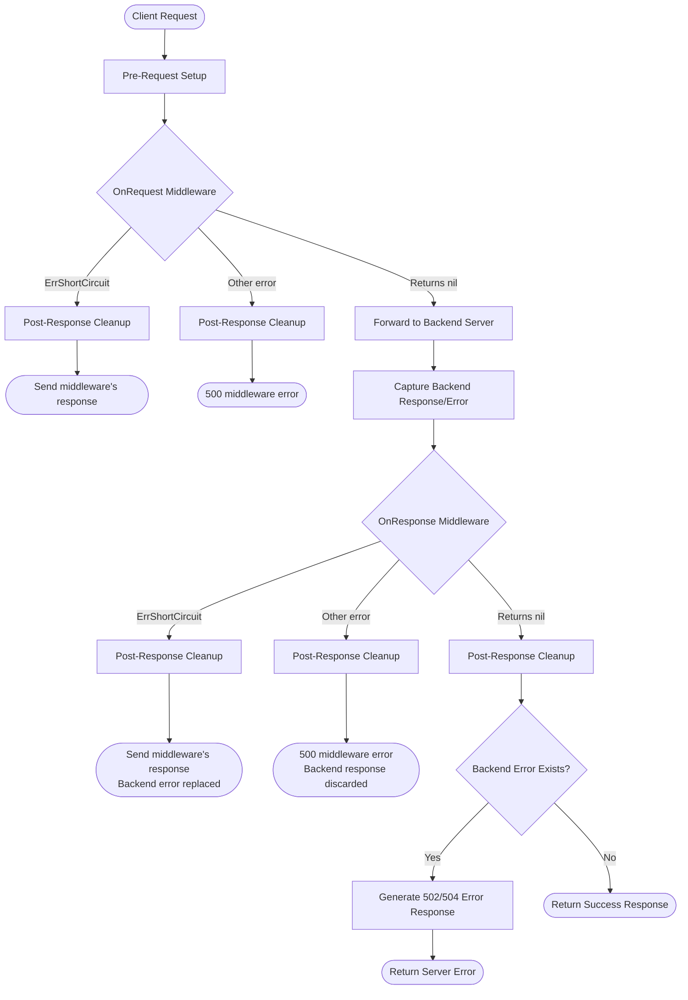

<br />
<div align="center">
  <h3 align="center">Divisor</h3>

  <p align="center">
    A fast and easy-to-configure load balancer
    <br />
    <br />
  </p>
</div>

<details>
  <summary>Table of Contents</summary>
  <ol>
    <li><a href="#about-the-project">About The Project</a></li>
    <li><a href="#features">Features</a></li>
    <li><a href="#installation">Installation</a></li>
    <li><a href="#usage">Usage</a></li>
    <li><a href="#configuration">Configuration</a></li>
    <li><a href="#custom-middleware">Custom Middleware</a></li>
    <li><a href="#limitations">Limitations</a></li>
    <li><a href="#benchmark">Benchmark</a></li>
    <li><a href="#todo">TODO</a></li>
    <li><a href="#contributors">Contributors</a></li>
    <li><a href="#license">License</a></li>
  </ol>
</details>

## About The Project
This project is designed to provide a fast and easy-to-configure load balancer in Go language. It currently includes **round-robin**, **weighted round-robin**, **least-connection**, **least-response-time**, **ip-hash** and **random** algorithms, but we have more to add to our [TODO](#todo) list.

The project is developed using the [fasthttp](https://github.com/valyala/fasthttp) library for HTTP/1.1, which ensures high performance. For HTTP/2 support, it uses the native Go `net/http` package with HTTP/2 configuration. Its purpose is to distribute the load evenly among multiple servers by routing incoming requests.

The project aims to simplify the configuration process for users while performing the essential functions of load balancers. Therefore, it offers several configuration options that can be adjusted to meet the users needs.

This project is particularly suitable for large-scale applications and websites. It can be used for any application that requires a load balancer, thanks to its high performance, ease of configuration, and support for different algorithms.


## Features
- Fast and easy-to-configure load balancer.
- Supports round-robin, weighted round-robin, least-connection, least-response-time, IP hash, and random algorithms.
- Supports TLS and HTTP/2 for the frontend server.
- Support for custom middleware written in Go.
- Uses the fasthttp library for HTTP/1.1 and native Go `net/http` package for HTTP/2, ensuring high performance and scalability.
- Offers multiple configuration options to suit user needs.
- Can handle large-scale applications and websites.
- Includes a built-in monitoring system that displays real-time information on the system's CPU usage, RAM usage, number of Goroutines, and open connections.
- Prometheus support for monitoring. (`http://monitoring-host:monitoring-port/metrics` can be used to get prometheus metrics)
- Provides information on each server's average response time, total request count, and last time used.
- Lightweight and efficient implementation for minimal resource usage.

## Installation

#### Downloading the Release
The latest release of Divisor can be downloaded from the [releases](https://github.com/aaydin-tr/divisor/releases) page. Choose the suitable binary for your system, download and extract the archive, and then move the binary to a directory in your system's $PATH variable (e.g. /usr/local/bin).

#### Building from Source
Alternatively, you can build Divisor from source by cloning this repository to your local machine and running the following commands:

```bash
git clone https://github.com/aaydin-tr/divisor.git &&
cd divisor &&
go build -o divisor &&
./divisor
```

#### Using go install
You can also install Divisor using the `go install` command:

```bash
go install github.com/aaydin-tr/divisor@latest
```

This will install the divisor binary to your system's `$GOPATH/bin` directory. Make sure this directory is included in your system's `$PATH` variable to make the divisor accessible from anywhere.

That's it! You're now ready to use Divisor in your project.

## Usage

You need a `config.yaml` file to use Divisor, you can give this file to Divisor to use with the `--config` flag, by default it will try to use a `config.yaml` file in the directory it is in. [Example config files](https://github.com/aaydin-tr/divisor/tree/main/examples)
> :warning: Please use absolute path for "config.yaml" while using "--config" flag

## Configuration

### Minimal Example
```yaml
port: 8000  # Required
backends:
  - url: localhost:8080
  - url: localhost:7070
```

### Core Settings

| Name | Description | Type | Default | Required |
| --- | --- | --- | --- | --- |
| port | Server port | string | - | ⚠️ **Yes** |
| host | Server host | string | `localhost` | No |
| type | Load balancing algorithm | string | `round-robin` | No |
| health_checker_time | Health check interval for backends | duration | `30s` | No |

**Valid algorithm types**: `round-robin`, `w-round-robin`, `ip-hash`, `random`, `least-connection`, `least-response-time`

### Backend Settings

| Name | Description | Type | Default | Required |
| --- | --- | --- | --- | --- |
| backends | List of backend servers | array | - | ⚠️ **Yes** (min: 1) |
| backends.url | Backend URL (without protocol) | string | - | ⚠️ **Yes** |
| backends.health_check_path | Health check endpoint | string | `/` | No |
| backends.weight | Backend weight (w-round-robin only) | int | - | ⚠️ **w-round-robin** |
| backends.max_conn | Max connections per backend | int | `512` | No |
| backends.max_conn_timeout | Max wait time for free connection | duration | `30s` | No |
| backends.max_conn_duration | Connection keep-alive duration | duration | `10s` | No |
| backends.max_idle_conn_duration | Idle connection timeout | duration | `10s` | No |
| backends.max_idemponent_call_attempts | Retry attempts for idempotent calls | int | `5` | No |

### Monitoring Settings

| Name | Description | Type | Default |
| --- | --- | --- | --- |
| monitoring.host | Metrics server host | string | `localhost` |
| monitoring.port | Metrics server port | string | `8001` |

### Server Settings

| Name | Description | Type | Default |
| --- | --- | --- | --- |
| server.http_version | HTTP protocol version: `http1` or `http2` (any other value is a startup error) | string | `http1` |
| server.cert_file | TLS certificate file path | string | - |
| server.key_file | TLS private key file path | string | - |
| server.max_idle_worker_duration | Worker pool idle timeout | duration | `10s` |
| server.tcp_keepalive_period | TCP keep-alive idle period for accepted client connections, on both HTTP/1.1 and HTTP/2 (Go's 15s default if unset) | duration | - |
| server.concurrency | Max concurrent connections | int | `262144` |
| server.read_timeout | Request read timeout | duration | unlimited |
| server.write_timeout | Response write timeout | duration | unlimited |
| server.idle_timeout | Keep-alive idle timeout | duration | unlimited |
| server.proxy_timeout | Bound on each upstream attempt; expiry returns 504. `0` means the default, not unlimited | duration | `60s` |
| server.max_request_body_size | Max request body size in bytes; larger bodies get 413 and never reach a backend. `0` means the default | int | `4194304` (4MB) |
| server.disable_keepalive | Force connection close after response | bool | `false` |

Header names are always normalized to canonical form (`x-api-key` → `X-Api-Key`) on both the request and the response, as RFC 9110 §5.1 makes them case-insensitive; middleware lookups such as `ctx.Request.Header.Peek("X-Api-Key")` therefore match whatever case the client sent.

### Custom Headers

| Name | Description | Type |
| --- | --- | --- |
| custom_headers | Headers injected into backend requests | map |
| custom_headers.`<name>` | Header value (special variables supported) | string |

**Special variables**: `$remote_addr` (client IP — the TCP peer that connected to divisor), `$time` (request timestamp, always UTC in RFC 3339 with milliseconds, e.g. `2026-08-23T09:41:07.123Z`), `$uuid` (request UUID), `$incremental` (per-Backend request sequence number — unique and increasing per Backend for the life of the process; see CONTEXT.md)

Divisor always forwards `X-Forwarded-For`: the client IP is appended to any chain the client sent (`client-sent, peer-ip`), so a Backend reads the rightmost entry as the address divisor actually saw. Client-sent chains are passed through, never trusted — behind another proxy, divisor's notion of the client IP (and the ip-hash key) is that proxy.

**Example**:
```yaml
custom_headers:
  x-client-ip: $remote_addr
  x-request-id: $uuid
```

### Middlewares

| Name | Description | Type | Default | Required |
| --- | --- | --- | --- | --- |
| middlewares | List of custom middleware | array | - | No |
| middlewares.name | Middleware identifier | string | - | ⚠️ **Yes** |
| middlewares.disabled | Skip middleware execution | bool | `false` | No |
| middlewares.code | Inline Go code | string | - | ⚠️ **Yes** (or file) |
| middlewares.file | Path to Go code file | string | - | ⚠️ **Yes** (or code) |
| middlewares.config | Config passed to middleware constructor | map | - | No |

### Important Notes

- **Backend address**: `backends[].url` must be a dialable `host:port`. An optional `http://` scheme and a bare trailing slash are accepted and stripped, and a missing port defaults to `80`. A path, query, or userinfo is rejected at startup, and so is `https://` — divisor terminates TLS itself and always speaks plain HTTP to backends
- **Unknown keys are errors**: a misspelled or removed key anywhere in the config (`proxy_timout`, `disable_header_names_normalizing`, …) fails startup with the offending key and line, instead of being silently ignored. `middlewares[].config` stays free-form
- **HTTP/2 requirement**: `server.http_version: http2` requires both `cert_file` and `key_file`
- **Weighted round-robin**: Single backend auto-converts to regular round-robin
- **Middleware validation**: Must specify either `code` OR `file` (not both), unless `disabled: true`
- **Custom header validation**: Only accepts the 4 special variables listed above
- **Default algorithm**: If `type` is omitted or invalid, defaults to `round-robin`


Please see [example config files](https://github.com/aaydin-tr/divisor/tree/main/examples)

## Custom Middleware

Divisor supports custom middleware written in Go. You can define middleware to intercept requests and responses, allowing you to implement custom logic such as authentication, logging, header manipulation, etc.

The middleware is executed using the [Yaegi](https://github.com/traefik/yaegi) interpreter.

### Usage

Your middleware must implement the `Middleware` interface and provide a `New` function constructor.

> :warning: Make sure you run `go get github.com/aaydin-tr/divisor/middleware` to import the middleware package. 

```go
package middleware

import (
    "github.com/aaydin-tr/divisor/middleware"
    "fmt"
)

type MyMiddleware struct {
    config map[string]any
}

func New(config map[string]any) middleware.Middleware {
    return &MyMiddleware{config: config}
}

func (m *MyMiddleware) OnRequest(ctx *middleware.Context) error {
    // Logic to execute before request reached to backend server
    // e.g. ctx.Request.Header.Set("X-Custom-Header", "Value")
    fmt.Println("OnRequest")
    return nil
}

func (m *MyMiddleware) OnResponse(ctx *middleware.Context, err error) error {
    // Logic to execute after response is received from backend server
    fmt.Println("OnResponse")
    return nil
}
```

### Configuration

You can configure middlewares in `config.yaml` using either inline code or a file path.

**Using a file:**

```yaml
middlewares:
  - name: "my-logger"
    file: "./middleware/logger.go"
    config:
      prefix: "[LOG]"
```

**Using inline code:**

```yaml
middlewares:
  - name: "simple-header"
    code: |
      package middleware
      
      import "github.com/aaydin-tr/divisor/middleware"

      type HeaderMiddleware struct {}

      func New(config map[string]any) middleware.Middleware {
          return &HeaderMiddleware{}
      }

      func (h *HeaderMiddleware) OnRequest(ctx *middleware.Context) error {
          ctx.Request.Header.Set("X-Divisor", "True")
          return nil
      }

      func (h *HeaderMiddleware) OnResponse(ctx *middleware.Context, err error) error {
          return nil
      }
```

### Short-circuiting

A middleware can answer the request itself — a **short-circuit**. Write the response to `ctx.Response` and return `middleware.ErrShortCircuit`: divisor sends that response exactly as you left it, asks no backend (from `OnRequest`) or skips its own 502/504 (from `OnResponse`), and runs no later middleware.

```go
package middleware

import "github.com/aaydin-tr/divisor/middleware"

type Guard struct{}

func New(config map[string]any) middleware.Middleware { return &Guard{} }

// Deny before the backend is asked.
func (g *Guard) OnRequest(ctx *middleware.Context) error {
    if len(ctx.Request.Header.Peek("X-Api-Key")) == 0 {
        ctx.SetStatusCode(401)
        ctx.SetBodyString("missing api key")
        return middleware.ErrShortCircuit
    }
    return nil
}

// Serve a fallback when the backend failed.
func (g *Guard) OnResponse(ctx *middleware.Context, err error) error {
    if err != nil {
        ctx.SetStatusCode(200)
        ctx.SetBodyString("cached page")
        return middleware.ErrShortCircuit
    }
    return nil
}
```

Any *other* non-nil error means the middleware failed: divisor discards whatever the response holds (a backend reply, an earlier middleware's edits, anything you wrote) and answers `500` with `{"message": "<error>"}`. Returning `nil` never stops the chain. Wrapping the sentinel (`fmt.Errorf("…: %w", middleware.ErrShortCircuit)`) still counts; the match is `errors.Is`.

### Request/Response Lifecycle

The middleware execution flow allows you to intercept and control the complete request/response lifecycle. Here's exactly what happens when a request is processed:

#### Complete Request Flow

1.  **Pre-Request Setup**
    -   Internal request preprocessing occurs
    -   Headers and request context are prepared

2.  **OnRequest Middleware Execution**
    -   Executed **before** the request is sent to the backend
    -   Receives the middleware context with full access to request/response
    -   **If `OnRequest` returns `middleware.ErrShortCircuit`:**
        -   ⛔ The execution chain stops **immediately**
        -   ⛔ The request is **NOT** sent to the backend
        -   ⛔ `OnResponse` is **NOT** called
        -   ⛔ Post-response cleanup occurs
        -   ✅ The response the middleware wrote is sent to the client unchanged (any status, including 200)
    -   **If `OnRequest` returns any other error:**
        -   ⛔ Same chain stop; the backend is **NOT** asked, `OnResponse` is **NOT** called
        -   ⛔ Whatever the middleware wrote is discarded; divisor answers `500` with `{"message": "<error>"}`
    -   **If `OnRequest` succeeds (returns `nil`):**
        -   ✅ Execution continues to backend proxy

3.  **Backend Proxy**
    -   The request is forwarded to the selected backend server
    -   The response (or error) is captured and stored
    -   **Important:** Even if the backend fails, execution continues to `OnResponse`

4.  **OnResponse Middleware Execution**
    -   **Always** executed after the proxy attempt (success or failure)
    -   Receives **two arguments:**
        1. The middleware context
        2. The backend error (if any) - will be `nil` on success
    -   You can inspect the backend error and decide how to handle it
    -   **If `OnResponse` returns `middleware.ErrShortCircuit`:**
        -   ✅ The response the middleware wrote is sent to the client unchanged — on a backend failure this replaces divisor's 502/504
        -   ⚠️ No later middleware runs; post-response cleanup occurs
    -   **If `OnResponse` returns any other error:**
        -   ⚠️ The middleware failed: the response (backend's or otherwise) is discarded and divisor answers `500` with `{"message": "<error>"}`
        -   ⚠️ No later middleware runs; post-response cleanup occurs
    -   **If `OnResponse` returns `nil`:**
        -   Execution continues normally
        -   If a backend error exists, divisor's standard `502 {"message":"bad gateway"}` (or `504 {"message":"gateway timeout"}` on `proxy_timeout`) is generated; headers the middleware added are kept
        -   If no error, the backend response (with any mutations the middleware made) is sent to the client

5.  **Post-Response Cleanup**
    -   Internal response postprocessing occurs
    -   Always executed regardless of success or failure

6.  **Response Sent**
    -   Final response is sent to the client

#### Key Takeaways

-   🎯 **OnRequest** acts as a gatekeeper - short-circuit to answer the client before the backend is asked
-   🔄 **OnResponse** always runs after the proxy attempt, giving you a chance to inspect backend errors
-   🛡️ **OnResponse** can short-circuit to replace a backend error with a response of its own
-   ⚠️ Any error other than `middleware.ErrShortCircuit` means "the middleware failed" and becomes a `500` — it never silently keeps or forwards a response
-   ⏱️ Both hooks have access to the full request/response context for inspection and modification

### Request/Response Diagram


```mermaid
flowchart TD
    Start([Client Request]) --> PreReq[Pre-Request Setup]
    PreReq --> OnReq{OnRequest Middleware}

    OnReq -->|ErrShortCircuit| PostRes1[Post-Response Cleanup]
    PostRes1 --> ReturnShort1([Send middleware's response])

    OnReq -->|Other error| PostRes4[Post-Response Cleanup]
    PostRes4 --> Return500a([500 middleware error])

    OnReq -->|Returns nil| Proxy[Forward to Backend Server]

    Proxy --> CaptureErr[Capture Backend Response/Error]
    CaptureErr --> OnRes{OnResponse Middleware}

    OnRes -->|ErrShortCircuit| PostRes2[Post-Response Cleanup]
    PostRes2 --> ReturnShort2([Send middleware's response<br/>Backend error replaced])

    OnRes -->|Other error| PostRes5[Post-Response Cleanup]
    PostRes5 --> Return500b([500 middleware error<br/>Backend response discarded])

    OnRes -->|Returns nil| PostRes3[Post-Response Cleanup]
    PostRes3 --> CheckBackendErr{Backend Error Exists?}

    CheckBackendErr -->|Yes| GenerateErr[Generate 502/504 Error Response]
    GenerateErr --> ReturnServerErr([Return Server Error])

    CheckBackendErr -->|No| ReturnOK([Return Success Response])
```

## Limitations
While Divisor has several features and benefits, it also has some limitations to be aware of:

- Divisor currently operates at layer 7, meaning it is specifically designed for HTTP(S) load balancing. It does not support other protocols, such as TCP or UDP.
- Divisor does not support HTTP/3, which may be important for some applications.
- Divisor does not support HTTPS for backend servers. HTTPS only available for frontend server.
- Divisor does not stream responses. The whole backend response is read before it is sent to the client (on HTTP/1.1 and HTTP/2 alike), so Server-Sent Events and other never-ending bodies do not work: nothing reaches the client and the request ends with `504` when `server.proxy_timeout` expires. Long-polling (a response that does eventually end) works; set `proxy_timeout` above the poll time.
- A client that disconnects does not cancel its backend request; the backend attempt runs until it answers or `server.proxy_timeout` expires, and the result is dropped.

Please keep these limitations in mind when considering whether this load balancer is the right choice for your project.

## Benchmark
Please see the [benchmark folder](https://github.com/aaydin-tr/divisor/tree/main/benchmark) for detail explanation 

## TODO
While Divisor has several features, there are also some areas for improvement that are planned for future releases:

- [ ] Add support for other protocols, such as TCP or UDP.
- [x] Add TLS support for frontend.
- [x] Support HTTP/2 in frontend server.
- [ ] Add more load balancing algorithms, such as,
  - [x] least connection
  - [x] least-response-time
  - [ ] sticky round-robin
- [ ] Improve performance and scalability for high-traffic applications.
- [x] Expand monitoring capabilities to provide more detailed metrics and analytics.

By addressing these issues and adding new features, we aim to make Divisor an even more versatile and powerful tool for managing traffic in modern web applications.

## Contributors
<a href = "https://github.com/aaydin-tr/divisor/graphs/contributors">
  
</a>

## License
This project is licensed under the MIT License. See the LICENSE file for more information.

The MIT License is a permissive open-source software license that allows users to modify and redistribute the code, as long as the original license and copyright notice are included. This means that you are free to use Divisor for any purpose, including commercial projects, without having to pay any licensing fees or royalties. However, it is provided "as is" and without warranty of any kind, so use it at your own risk.