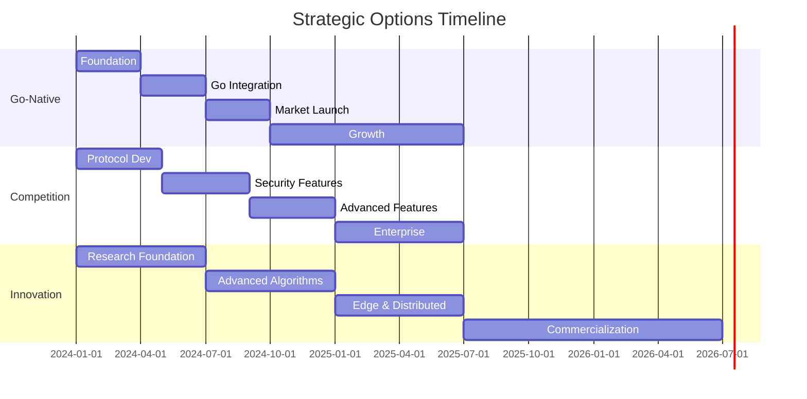

# Strategic Options Comparison Matrix

## 📊 Executive Summary

This document provides a comprehensive comparison of the three strategic paths for Divisor's future development, helping you make an informed decision based on your resources, risk tolerance, and market goals.

## 🎯 Strategic Options Overview

| Aspect | Go-Native Niche | Feature Competition | Innovation Route |
|--------|----------------|-------------------|------------------|
| **Timeline** | 12 months | 18+ months | 24-36 months |
| **Budget** | $282K/year | $1M+/year | $500K-$2M/year |
| **Risk Level** | Medium | High | Very High |
| **Market Potential** | $50M | $4.8B | $10B+ |
| **Technical Complexity** | Medium | High | Very High |
| **Competitive Advantage** | Sustainable | Temporary | Revolutionary |

## 📈 Detailed Comparison Matrix

### Market Opportunity Assessment

| Criteria | Go-Native Niche | Feature Competition | Innovation Route |
|----------|----------------|-------------------|------------------|
| **Target Market Size** | $480M (Go ecosystem) | $4.8B (entire LB market) | $10B+ (AI infrastructure) |
| **Market Growth Rate** | 25% (Go adoption) | 17% (traditional LB) | 45% (AI infrastructure) |
| **Competition Intensity** | Low (no direct competitors) | Very High (HAProxy, NGINX) | Low (emerging field) |
| **Market Readiness** | High (Go is mainstream) | High (mature market) | Medium (early adopters) |
| **Differentiation Potential** | High (unique positioning) | Low (feature parity) | Very High (breakthrough tech) |

### Technical Implementation Complexity

| Component | Go-Native Niche | Feature Competition | Innovation Route |
|-----------|----------------|-------------------|------------------|
| **Core Development** | Moderate | High | Very High |
| **Protocol Support** | HTTP/HTTPS focus | Multi-protocol required | Novel protocols |
| **Algorithm Complexity** | Standard + Go optimizations | Advanced algorithms | AI/ML algorithms |
| **Integration Requirements** | Go ecosystem | Multiple ecosystems | Research frameworks |
| **Testing Complexity** | Standard | Extensive | Experimental validation |
| **Maintenance Burden** | Low-Medium | High | Very High |

### Resource Requirements Analysis

#### Go-Native Niche Strategy
```yaml
Team Structure (Total: 2.0 FTE):
  Lead Developer: 1.0 FTE
  DevOps Engineer: 0.5 FTE
  Documentation Writer: 0.25 FTE
  Community Manager: 0.25 FTE

Annual Budget: $282,000
  Salaries: $250,000
  Infrastructure: $12,000
  Marketing: $15,000
  Tools: $5,000

Technology Stack:
  - Go 1.21+, fasthttp
  - GitHub Actions, GoReleaser
  - Docker, Kubernetes
  - Prometheus, OpenTelemetry
```

#### Feature Competition Strategy
```yaml
Team Structure (Total: 10.5 FTE):
  Core Engineers: 3.0 FTE
  Security Engineer: 1.0 FTE
  DevOps Engineers: 2.0 FTE
  QA Engineers: 2.0 FTE
  Technical Writers: 1.0 FTE
  Community Manager: 0.5 FTE
  Product Manager: 1.0 FTE

Annual Budget: $1,010,000
  Salaries: $850,000
  Infrastructure: $50,000
  Security Audits: $30,000
  Performance Testing: $25,000
  Marketing: $40,000
  Legal: $15,000

Technology Stack:
  - Go, C++, Rust (multi-language)
  - Advanced networking libraries
  - Enterprise security tools
  - Comprehensive testing frameworks
```

#### Innovation Route Strategy
```yaml
Team Structure (Variable: 3-15 FTE):
  Research Scientists: 2-5 FTE
  ML Engineers: 2-4 FTE
  Core Engineers: 1-3 FTE
  Research Associates: 1-3 FTE

Annual Budget: $500K-$2M (phase dependent)
  Research Team: $400K-$1.5M
  Infrastructure: $50K-$200K
  Research Equipment: $25K-$100K
  Publications/Patents: $25K-$200K

Technology Stack:
  - Python/Go hybrid
  - TensorFlow/PyTorch
  - Quantum computing frameworks
  - Cloud computing platforms
  - Research databases
```

## ⚖️ Risk-Reward Analysis

### Risk Assessment Matrix

| Risk Factor | Go-Native | Feature Competition | Innovation |
|-------------|-----------|-------------------|------------|
| **Technical Risk** | Low | Medium | Very High |
| **Market Risk** | Medium | High | High |
| **Execution Risk** | Low | High | Very High |
| **Financial Risk** | Low | Very High | High |
| **Competitive Risk** | Low | Very High | Low |
| **Timeline Risk** | Low | High | Very High |

### Reward Potential Matrix

| Reward Factor | Go-Native | Feature Competition | Innovation |
|---------------|-----------|-------------------|------------|
| **Revenue Potential** | Medium ($5-20M) | High ($50-200M) | Very High ($100M+) |
| **Market Share** | Medium (10% of Go LB) | Low (2-5% overall) | High (market creator) |
| **Brand Recognition** | Medium | Low | Very High |
| **Strategic Value** | Medium | Low | Very High |
| **Exit Potential** | Medium ($20-50M) | Low-Medium ($50-100M) | High ($200M+) |

## 🎯 Success Probability Assessment

### Probability of Success (Conservative Estimates)

| Outcome Level | Go-Native | Feature Competition | Innovation |
|---------------|-----------|-------------------|------------|
| **Survival (Break-even)** | 80% | 40% | 30% |
| **Success (Profitable)** | 60% | 25% | 20% |
| **Major Success (Market leader)** | 25% | 10% | 15% |
| **Breakthrough (Industry changer)** | 5% | 2% | 40% |

### Key Success Factors

#### Go-Native Strategy
✅ **High Probability Factors:**
- Clear target market (Go developers)
- Manageable scope and complexity
- Sustainable resource requirements
- Low competition in niche

⚠️ **Risk Factors:**
- Limited market size
- Dependency on Go language popularity
- Potential niche market saturation

#### Feature Competition Strategy
✅ **High Probability Factors:**
- Large addressable market
- Clear customer pain points
- Proven market demand

⚠️ **Risk Factors:**
- Intense competition from established players
- High resource requirements
- Long development timeline
- Difficult differentiation

#### Innovation Route Strategy
✅ **High Probability Factors:**
- Potential for revolutionary breakthrough
- First-mover advantage
- High barrier to entry once established
- Massive market potential

⚠️ **Risk Factors:**
- Uncertain technical feasibility
- Long research timeline
- High funding requirements
- Market readiness questions

## 📅 Timeline Comparison

### Development Milestones



### Revenue Timeline

| Year | Go-Native | Feature Competition | Innovation |
|------|-----------|-------------------|------------|
| **Year 1** | $0 | $0 | $0 |
| **Year 2** | $500K | $0 | $0 |
| **Year 3** | $2M | $1M | $0 |
| **Year 4** | $5M | $5M | $2M |
| **Year 5** | $8M | $15M | $20M |

## 🎲 Decision Framework

### Scenario-Based Recommendations

#### Choose Go-Native Niche IF:
- ✅ You have limited resources (<$500K budget)
- ✅ You want sustainable, steady growth
- ✅ You're passionate about the Go ecosystem
- ✅ You prefer lower risk with moderate reward
- ✅ You have strong Go community connections

#### Choose Feature Competition IF:
- ✅ You have significant funding ($1M+ secured)
- ✅ You have enterprise sales experience
- ✅ You can build a large engineering team quickly
- ✅ You're comfortable with high-risk/high-reward scenarios
- ✅ You have deep load balancer domain expertise

#### Choose Innovation Route IF:
- ✅ You have access to research funding/grants
- ✅ You have PhD-level research team or access
- ✅ You're willing to work on 3-5 year timelines
- ✅ You want to potentially change the industry
- ✅ You have connections in AI/ML research community

### Hybrid Approach Considerations

#### Go-Native → Innovation Transition
```yaml
Phase 1 (Months 1-12): Go-Native Foundation
  - Build solid Go-native load balancer
  - Establish community and user base
  - Generate revenue for research funding

Phase 2 (Months 13-24): Add Innovation Elements
  - Integrate AI-driven routing as premium feature
  - Maintain backward compatibility
  - Use profits to fund research

Benefits:
  - Lower initial risk
  - Revenue to fund innovation
  - Market validation before major investment
```

#### Competition → Innovation Pivot
```yaml
Phase 1 (Months 1-18): Feature Parity
  - Build competitive feature set
  - Establish enterprise customer base
  - Validate product-market fit

Phase 2 (Months 19-36): Innovation Layer
  - Add AI/ML capabilities as differentiator
  - Patent key innovations
  - Position as next-generation solution

Benefits:
  - Proven market before innovation investment
  - Customer base to test innovations
  - Revenue to fund research
```

## 📊 Financial Projections

### Net Present Value (NPV) Analysis (5-Year, 10% Discount Rate)

| Strategy | Investment | NPV | ROI | Payback Period |
|----------|------------|-----|-----|----------------|
| **Go-Native** | $1.4M | $8.2M | 586% | 2.5 years |
| **Feature Competition** | $5.1M | $12.8M | 251% | 4 years |
| **Innovation Route** | $8.5M | $45.2M | 532% | 4.5 years |

### Sensitivity Analysis

#### Go-Native Strategy Scenarios
| Scenario | Probability | 5-Year Revenue | NPV |
|----------|-------------|----------------|-----|
| **Pessimistic** | 30% | $8M | $2.1M |
| **Base Case** | 40% | $15M | $8.2M |
| **Optimistic** | 30% | $25M | $16.8M |

#### Feature Competition Scenarios
| Scenario | Probability | 5-Year Revenue | NPV |
|----------|-------------|----------------|-----|
| **Pessimistic** | 50% | $10M | -$2.1M |
| **Base Case** | 35% | $35M | $12.8M |
| **Optimistic** | 15% | $75M | $38.2M |

#### Innovation Route Scenarios
| Scenario | Probability | 5-Year Revenue | NPV |
|----------|-------------|----------------|-----|
| **Pessimistic** | 40% | $5M | -$5.8M |
| **Base Case** | 35% | $45M | $45.2M |
| **Breakthrough** | 25% | $150M | $125.8M |

## 🎯 Final Recommendation Matrix

Based on different organizational contexts:

### For Bootstrapped Startups
**Recommended: Go-Native Niche**
- Reason: Manageable risk, sustainable growth, clear path to profitability
- Timeline: Revenue within 18 months
- Success Probability: 60%

### For Well-Funded Startups ($1M+)
**Recommended: Feature Competition → Innovation Hybrid**
- Reason: Market validation first, then innovation layer
- Timeline: Revenue within 24 months, innovation within 36 months
- Success Probability: 45%

### For Research-Oriented Organizations
**Recommended: Innovation Route**
- Reason: Breakthrough potential, grant funding available, long-term vision
- Timeline: Breakthrough within 48 months
- Success Probability: 35% (but highest reward potential)

### For Enterprise-Backed Projects
**Recommended: Feature Competition**
- Reason: Enterprise customers need feature parity, resources available
- Timeline: Enterprise sales within 30 months
- Success Probability: 40%

## 📋 Decision Checklist

Before making your final decision, ensure you have:

- [ ] **Resource Assessment**: Confirmed available budget and team capacity
- [ ] **Risk Tolerance**: Evaluated your comfort with uncertainty and timeline
- [ ] **Market Research**: Validated target market needs and size
- [ ] **Technical Assessment**: Evaluated team's technical capabilities
- [ ] **Competitive Analysis**: Understood competitive landscape deeply
- [ ] **Timeline Alignment**: Matched strategy with business timeline needs
- [ ] **Success Metrics**: Defined clear success criteria for chosen path
- [ ] **Exit Strategy**: Considered potential exit scenarios and valuations
- [ ] **Stakeholder Alignment**: Ensured all stakeholders support chosen direction
- [ ] **Contingency Planning**: Developed backup plans for major risks

This comparison matrix provides the analytical foundation for choosing the strategic direction that best aligns with your resources, goals, and risk tolerance. 